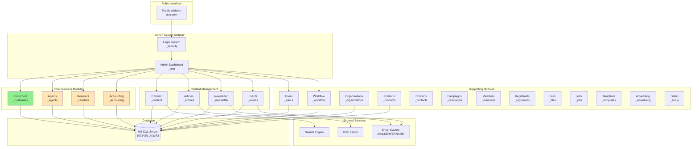
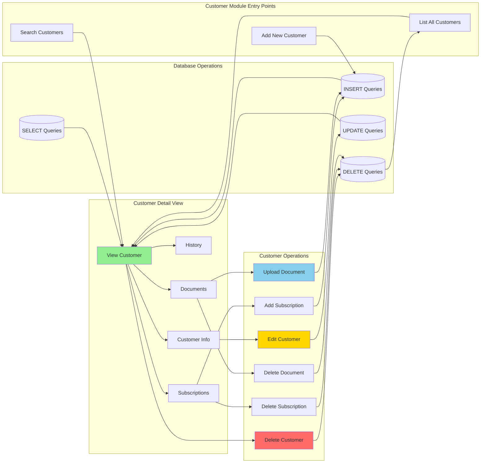
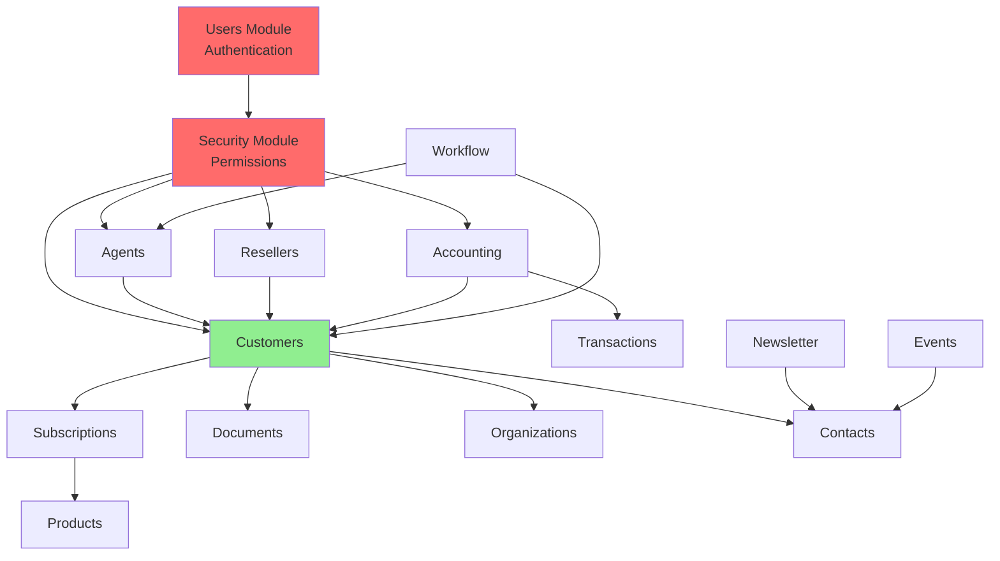
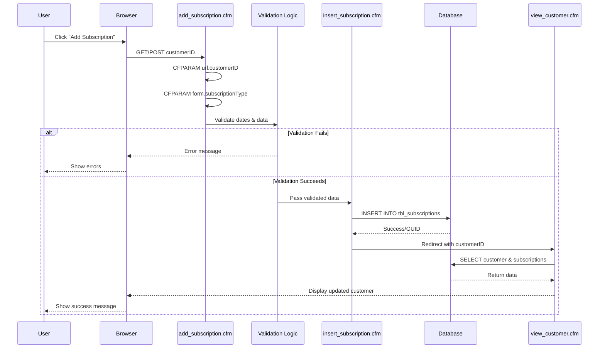
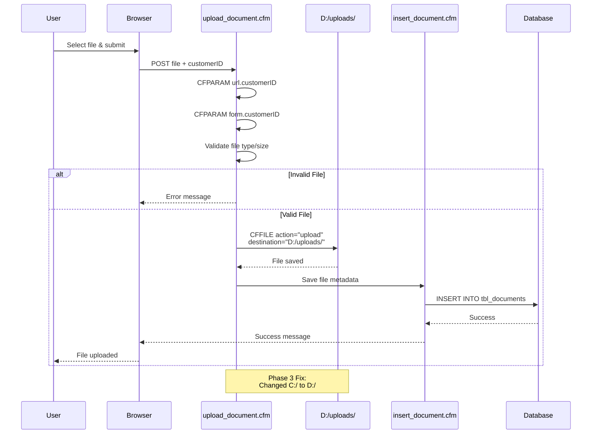
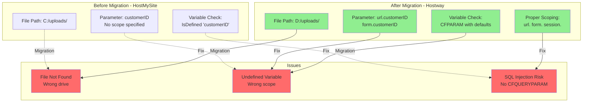
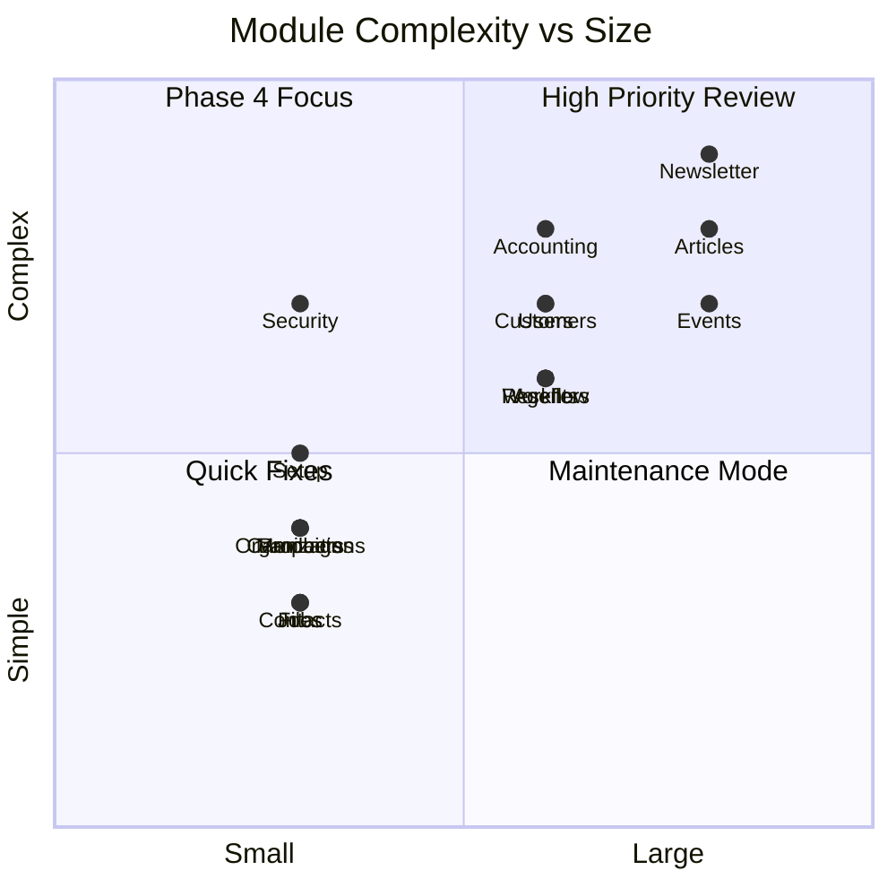

# ALWR System Architecture - Visual Diagrams

## System Architecture Overview

## Customer Management Module - Detailed Flow

## Module Dependency Map

## Data Flow - Customer Subscription Creation

## File Upload Flow (Phase 3 Fix)

## Common Bug Pattern (Migration Issues)

## Module Size & Complexity Matrix

## Testing Flow Phases

```mermaid
graph LR
    subgraph "Phase 3 - Completed"
        P3A[Customer Module]
        P3B[Subscriptions]
        P3C[Documents]
        P3D[Search]
        P3E[Pagination]
    end
    
    subgraph "Phase 4 - Proposed"
        P4A[Users Module]
        P4B[Agents Module]
        P4C[Resellers Module]
        P4D[Accounting Module]
    end
    
    subgraph "Phase 5+ - Future"
        P5A[Content Modules]
        P5B[Newsletter/Events]
        P5C[Supporting Modules]
        P5D[Security Audit]
    end
    
    P3A --> P3B
    P3B --> P3C
    P3C --> P3D
    P3D --> P3E
    P3E --> P4A
    P4A --> P4B
    P4B --> P4C
    P4C --> P4D
    P4D --> P5A
    P5A --> P5B
    P5B --> P5C
    P5C --> P5D
    
    style P3A fill:#90EE90
    style P3B fill:#90EE90
    style P3C fill:#90EE90
    style P3D fill:#90EE90
    style P3E fill:#90EE90
    style P4A fill:#FFD700
    style P4B fill:#FFD700
    style P4C fill:#FFD700
    style P4D fill:#FFD700
```

